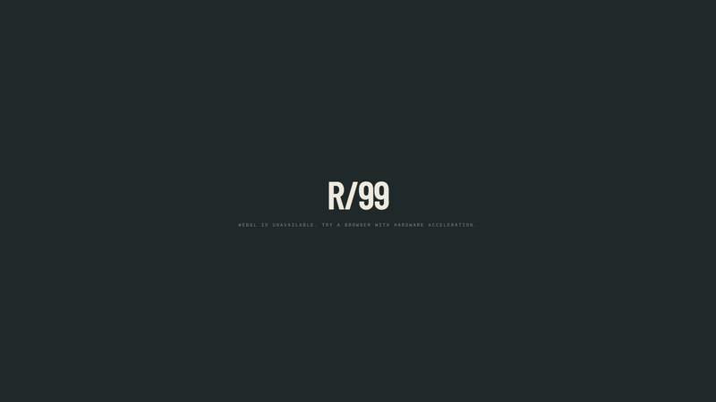
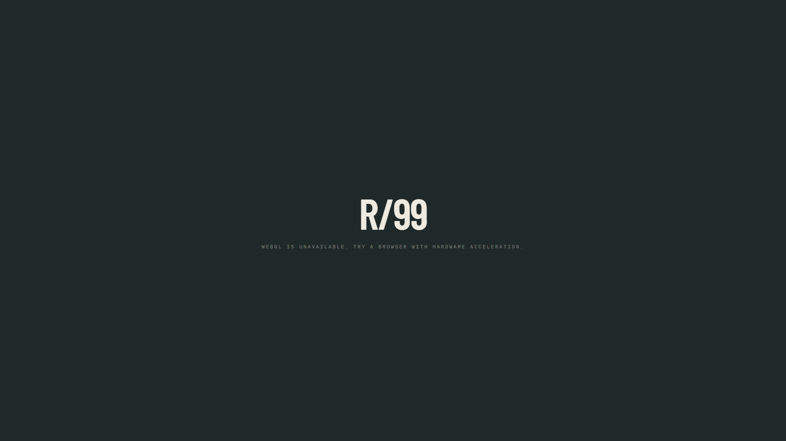
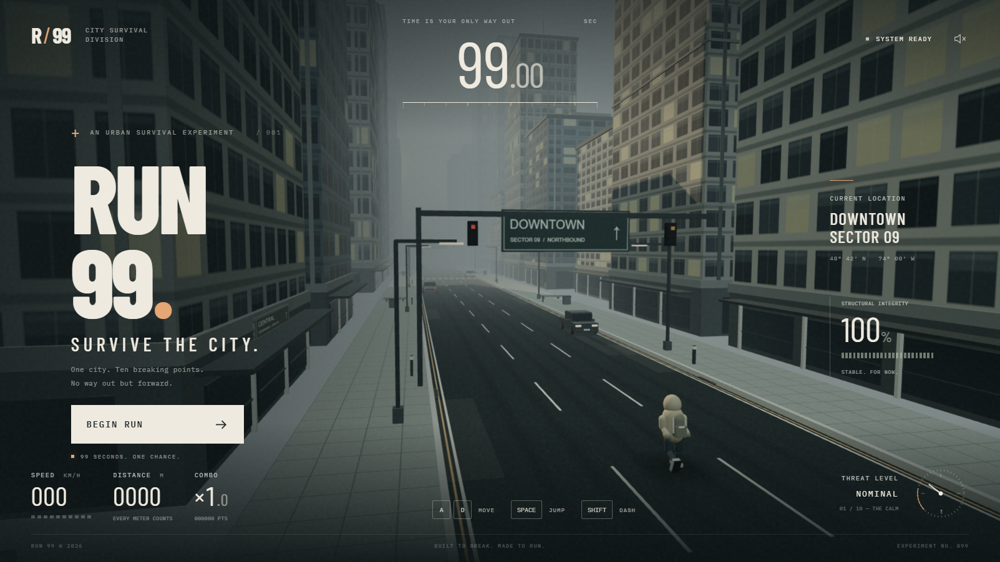
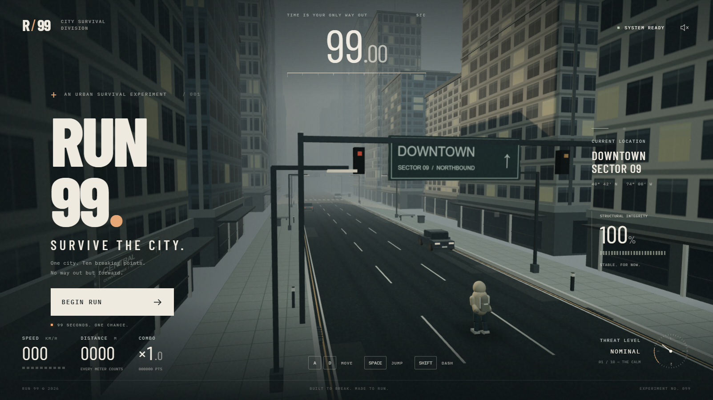

# ⚡ RUN 99 — Survive the City

  

  
  
  
  

---

## 🎮 Live Demo & Gameplay Video

### 🌐 Play directly in your browser:
👉 **[https://run99-a.deploylane.online/](https://run99-a.deploylane.online/)**

### 🎬 Gameplay Preview

  

> 📹 **HD Video File**: [`assets/gameplay_demo.mp4`](assets/gameplay_demo.mp4)

---

## 📸 Gameplay Screenshots

<table width="100%">
  <tr>
    <td width="50%" align="center">
      <b>🌇 3D City & Title Screen</b>  
      
    </td>
    <td width="50%" align="center">
      <b>🏃 High-Speed Runner Action</b>  
      
    </td>
  </tr>
  <tr>
    <td width="50%" align="center">
      <b>🌌 Phase 4: Blackout & Emergency Lights</b>  
      
    </td>
    <td width="50%" align="center">
      <b>📊 Finale & Stats Telemetry</b>  
      
    </td>
  </tr>
</table>

---

## 📖 About The Game

**RUN 99** is an immersive, full-screen 3D web survival runner powered by **Three.js**. 

Your objective is simple yet thrilling: **survive 99.00 seconds of escalating urban chaos** while navigating through a procedural 3D metropolis that transforms dynamically across 10 environmental phases.

### ✨ Key Features
- **Zero Landing Menus**: Title UI is integrated directly inside the live 3D environment.
- **10 Dynamic Environmental Phases**: From sunlit streets to torrential downpours, blackouts, falling debris, floating obstacles, and full urban collapse.
- **Decoupled 120 Hz Physics Simulation**: Ultra-smooth fixed-timestep gameplay logic separated from frame rendering.
- **Rich Mechanic Systems**: 3-lane lateral movement, high jumps, protective dash bursts with cooldowns, moving traffic, and falling rubble warning zones.
- **Dynamic Scoring & Combos**: Score multipliers up to 5× with near-miss bonuses and risky jump rewards.
- **Responsive & Accessible**: Complete desktop (keyboard) and mobile (touch & gestures) control support.

---

## 🕹️ Controls

| Action | Keyboard Controls | Touch / Mobile |
| :--- | :--- | :--- |
| **Move Left / Right** | <kbd>A</kbd> / <kbd>D</kbd> or <kbd>←</kbd> / <kbd>→</kbd> | Left / Right Buttons or Horizontal Swipe |
| **Jump** | <kbd>Space</kbd> or <kbd>↑</kbd> | Jump Button, Upward Swipe, or Tap Screen |
| **Dash Burst** | <kbd>Shift</kbd> | DASH Button or Downward Swipe |
| **Pause / Resume** | <kbd>Esc</kbd> / <kbd>P</kbd> | Header Pause Icon |
| **Start / Restart** | <kbd>Enter</kbd> / <kbd>Space</kbd> | Tap Main Screen Button |

---

## 🌪️ 10 Environmental Phases (0s - 99s)

| Time | Phase Name | Gameplay Effect & Hazards |
| :---: | :--- | :--- |
| `00s–10s` | **The Calm** | Baseline obstacles, cars, and clear escape routes. |
| `10s–20s` | **Downpour** | Heavy rain streaks; slippery lateral steering response. |
| `20s–30s` | **Gridlock** | Fast approaching traffic with aggressive lane-changing cars. |
| `30s–40s` | **Blackout** | City power cut; vehicle headlights & route indicators essential. |
| `40s–50s` | **Falling Sky** | Falling concrete rubble signaled by amber ground impact zones. |
| `50s–60s` | **High Water** | Grounded flood drag; jumping & dashing preserves speed. |
| `60s–70s` | **Weightless** | Reduced gravity, floaty jumps, and floating aerial hazards. |
| `70s–80s` | **Fault Line** | Earthquakes, drifting lane centers, and shifting structures. |
| `80s–90s` | **Cascade** | Combined hazards: rain steering, flood drag, traffic & falling rubble. |
| `90s–99s` | **Collapse** | **CITY INSTABILITY 98%**: Extreme speed, sinking buildings, total chaos! |

---

## 🏆 Scoring System

- **Distance & Time**: `floor(distance × 2 + seconds × 15 + bonusPoints)`
- **Bonus Rewards**:
  - Fragment Collectibles: `+35 pts`
  - Risky Fragments: `+150 pts`
  - Near Misses: `+120 pts`
  - Dash Breakthroughs: `+80 pts`
- **Combos**: Increments by `0.25×` per bonus up to **5.0×**!
- **Victory Bonus**: Successfully surviving 99.00 seconds grants a **+9,900 point bonus**!

---

## 🛠️ Tech Stack & Architecture

- **Frontend**: HTML5, CSS3, JavaScript (ES6+)
- **3D Graphics Engine**: [Three.js (v0.160.0)](https://threejs.org/)
- **Physics & Logic**: Fixed 120Hz decoupled simulation loop ([`js/core.js`](js/core.js))
- **Render Engine**: Custom WebGL shaders, reflections, lighting & particle effects ([`js/game.js`](js/game.js))
- **Live Deployment Platform**: [Deploylane](https://deploylane.com) — Hosted at [https://run99-a.deploylane.online/](https://run99-a.deploylane.online/)

---

## 👨‍💻 About Me

<table align="center">
  <tr>
    <td align="center">
       
      <b>Jatin</b> 
      <i>Frontend & Creative Web Developer</i>
    </td>
    <td>
      Hi! I'm <b>Jatin</b>, a passionate Web Developer crafting interactive 3D web experiences, games, and modern web applications. 🚀  
      <ul>
        <li>🌐 <b>Live Project Host</b>: <a href="https://run99-a.deploylane.online/">https://run99-a.deploylane.online/</a> (Deployed via <b>Deploylane</b>)</li>
        <li>💻 <b>GitHub Profile</b>: <a href="https://github.com/Jatinnn-ui">@Jatinnn-ui</a></li>
        <li>🎮 <b>Project Repository</b>: <a href="https://github.com/Jatinnn-ui/run99-A">Jatinnn-ui/run99-A</a></li>
        <li>⚡ <b>Specialties</b>: JavaScript, Three.js, WebGL, UI/UX Design & Full-Stack Web Development</li>
      </ul>
    </td>
  </tr>
</table>

---

  Made with ❤️ by <a href="https://github.com/Jatinnn-ui">Jatin</a> | Deployed on <a href="https://run99-a.deploylane.online/">Deploylane</a>

